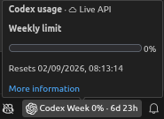
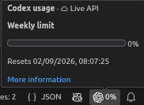
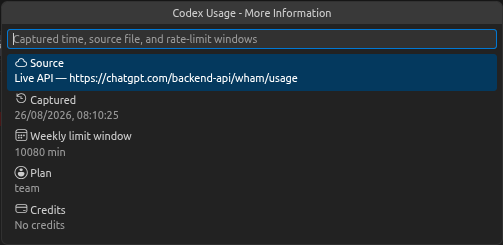

# Codex Usage for VS Code

A lightweight VS Code extension that shows your OpenAI Codex CLI rate limits
in the status bar. It can read local Codex session data offline, or query the
live Codex usage endpoint using the credential you are already logged in with.

## Features

- Shows each available rate-limit window, usage percentage, and time to reset.
- **Online or offline:** query the live Codex usage API with your existing
  login, or read local rollout files with no network access at all.
- **Compact or full footer:** show a minimal percent chip or the full
  per-window breakdown.
- Provides usage bars and exact reset times on hover or click.
- Adapts to the windows reported by your plan, including 5-hour, daily,
  weekly, and monthly limits.
- Displays plan, credits, and spend-control information when available.
- Supports current and legacy Codex rollout schemas.

The status bar displays a summary of each window (usage percent and time to
reset):



or, in compact mode, just the Codex logo and a single percent:




## Installation

1. Download the latest `.vsix` file from
   [GitHub Releases](https://github.com/Ganymede404/vscode-codex-usage/releases).
2. In VS Code, run **Extensions: Install from VSIX...** from the Command
   Palette and select the downloaded file.

VS Code 1.85 or later and an existing Codex CLI session are required.

## How It Works

### Online (API) mode

When you are logged in with the Codex CLI (`codex login`), the extension can
read your live usage directly from Codex's backend. It reads the OAuth access
token and ChatGPT account id already stored in `~/.codex/auth.json` and sends a
read-only `GET` to `https://chatgpt.com/backend-api/wham/usage`. Nothing is
written back, and the login token is never refreshed by this extension — if the
token has expired, run `codex login` (or just use Codex) and the extension picks
up the refreshed token automatically. This endpoint is undocumented and may
change; the extension parses it defensively and falls back to rollout files if
the response does not fit.

### Offline (rollout) mode

Codex CLI writes JSONL rollout files to:

```text
~/.codex/sessions/YYYY/MM/DD/rollout-*.jsonl
```

The extension scans recent rollouts and uses the latest `token_count` event
with rate-limit data. Windows are labeled by their reported duration rather
than by their `primary` or `secondary` slot. Both `resets_at` and the legacy
`resets_in_seconds` field are supported.

### Choosing a source

The `codexUsage.source` setting controls which is used:

- `auto` (default) — query the API when you are logged in, otherwise read
  rollout files.
- `api` — always query the API.
- `rollout` — always read local rollout files (fully offline).

In `auto` and `api` modes, if the live query can't run (not logged in, expired
token, offline) the extension falls back to the latest rollout snapshot and
notes why in the tooltip.

## Settings

| Setting | Default | Description |
| --- | --- | --- |
| `codexUsage.source` | `auto` | Data source: `auto`, `api` (online), or `rollout` (offline). |
| `codexUsage.compactStatusBar` | `false` | Show a compact percent chip instead of the full breakdown. |
| `codexUsage.statusBarAlignment` | `left` | Which side of the status bar the usage item appears on (`left` or `right`). |
| `codexUsage.codexHome` | `~/.codex` | Codex home directory. |
| `codexUsage.refreshIntervalSeconds` | `60` | How often to refresh usage, in seconds. |
| `codexUsage.lookbackDays` | `7` | Number of days to scan for rollout files. |

## Commands

| Command | Description |
| --- | --- |
| **Codex Usage: Refresh** | Refresh the current usage snapshot. |
| **Codex Usage: Show Usage** | Open the usage summary. |
| **Codex Usage: Show More Information** | Show snapshot and account details. |
| **Codex Usage: Open Sessions Folder** | Reveal the Codex sessions directory. |

**Codex Usage: Show More Information** opens a detail view with the snapshot
source, capture time, rate-limit windows, plan, and credits:



## Development

```sh
npm install
npm run compile
```

Press `F5` in VS Code to launch an Extension Development Host.

## Limitations

- Codex `exec` mode may emit `rate_limits: null`. These events are skipped;
  usage remains unavailable until Codex writes a populated event.
- Usage reflects the latest local rollout snapshot and cannot update more
  frequently than Codex writes that data.
